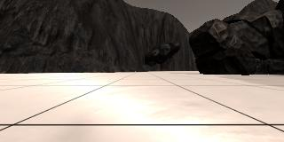
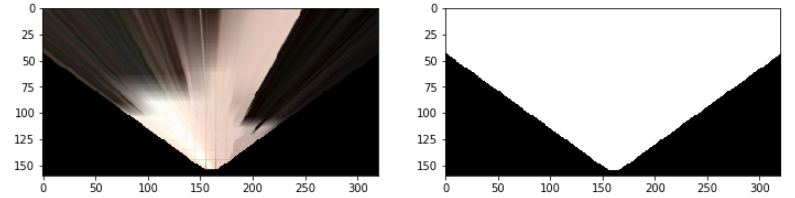
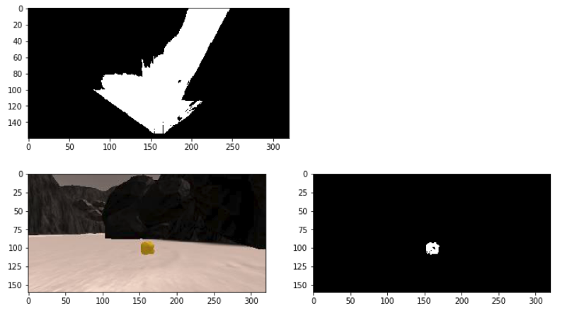
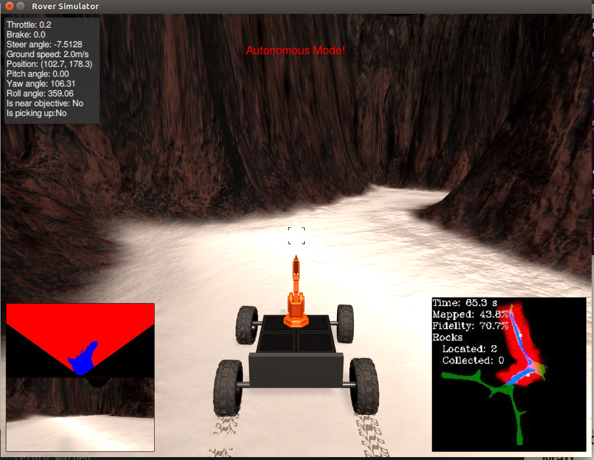

# <span style="color:darkslateblue"> Project: Search and Sample Return </span>
### Writeup: Tuan Le
### Date: July 2018
---
# 1) Introduction
This mini project represents the NASA rover project of sample searching and returning. The passing requirement of this project is to map at least ***40%*** of the environment at ***60%*** of fidelity and locate at least ***one*** rock sample in the map.

Code was written in Python and run on Jupyter Notebook and Unity Simulation Software provided by Udacity. In the Jupyter Notebook, there are three main functions contributes to the image processing pipeline of the robot. These three functions were used in perception.py when running the robot in the Unity Simulation environment.

At the end of the Jupyter Notebook, a video was produced based on image data recorded during **the training mode** in the Unity Simulation environment. **Record Data** is stored in the *record_data* folder which contains **/IMG** folder and **robot_log.csv** file.

* [**Record data folder**](./record_data)

After implementing perception/image processing code in Jupyter Notebook, I ran the same code on Unity Simulation environment with following parameter values:

* Unity Simulator Screen Resolution: **1024 x 640**
* Unity Simulator Graphics Quality: **Fantastic**
* FPS value of drive_rover.py: **16-18 FPS**

# 2) Jupyter Notebook Analysis
In general, there are three main stages which covered in this project (Action, Decision, and Perception). Jupyter Notebook Analysis concentrates on Perception part where the image processing pipeline was implemented to output following goals for the Decision stage.

* Determine Turning/Yaw Angle
* Search Rock Samples
* Update World Map

These goals can be achieved by taking in first-person images from the rover front camera and input to the ***image_processing()*** function. This function contains seven important functions (**perspective_transform()**, **color_threshold()**, **rover_coords()**, **to_polar_coords()**, **rotate_pix()**, **translate_pix()**, and **pix_to_world()**)

## 2.1) Perspective Transform (PT) Function
Perspective Transformation is a step that convert a first-person view image into a top-down view image. This step was implemented by using ***cv2.getPerspectiveTransform()*** and ***cv2.warpPerspective()*** functions from the OpenCV library.

Firstly, the perspective transformation was done with the help of the calibrated grid image. Coordinates of four corners of the grid square are taken as a source (first-person view image).

Secondly, coordinates of a destination image (top-down view image) were calculated so that the first-person coordinates will be transformed into a top-down coordinates which is a 5x5 pixels square. This square sat at the bottom-center of the destination image.

<p align="center">  </p>

Finally, an offset from the bottom of the destination image was added to account for the invisible distance from rover edge to the first-person view in image.

Additionally, I create an extra image array of 1 and 0 just to store navigable area in front of the rover. This array called ***mask***.

```Python
# Define a function to perform a perspective transform
def perspect_transform(img, src, dst):

    M = cv2.getPerspectiveTransform(src, dst)
    # Keep same size as input image
    warped = cv2.warpPerspective(img, M, (img.shape[1], img.shape[0]))
    # Create a mask of a field of view of the robot
    mask = cv2.warpPerspective(np.ones_like(img[:,:,0]), M, (img.shape[1], img.shape[0]))
    return warped, mask

# These source and destination points are defined to warp the image
# to a grid where each 10x10 pixel square represents 1 square meter
# The destination box will be 2*dst_size on each side
dst_size = 5

# Set a bottom offset to account for the fact that the bottom of the image
# is not the position of the rover but a bit in front of it
# this is just a rough guess, feel free to change it!
bottom_offset = 6

# Set a list of coordinate of the square in the source image.
source = np.float32([[14,  140],
                     [301, 140],
                     [200,  96],
                     [118,  96]])

# Calculate coordinates of the destination pixel.
destination = np.float32([[image.shape[1]/2 - dst_size, image.shape[0] -              bottom_offset],
                          [image.shape[1]/2 + dst_size, image.shape[0] -              bottom_offset],
                          [image.shape[1]/2 + dst_size, image.shape[0] - 2*dst_size - bottom_offset],
                          [image.shape[1]/2 - dst_size, image.shape[0] - 2*dst_size - bottom_offset],
                          ])

warped, mask = perspect_transform(grid_img, source, destination)
```
##### Plotting warping image and masking image
This shows output image after the transformation.

```Python
fig = plt.figure(figsize=(12,3))
plt.subplot(121)
plt.imshow(warped)
plt.subplot(122)
plt.imshow(mask, cmap='gray')
```
<p align="center"></p>

## 2.2) Color Threshold (CT) Function

The next important step is to identify navigable, obstacle, and rock sample in the environment. One of the simple way is using color thresholding technique. The technique simply compares RGB values of an image with pre-determined RGB values. Because the navigable area and rock samples have different color, distinguishing these two objects are relatively easy.

##### Navigable area

After warping the perspective of the robot, the navigable area shows a brighter color than un-navigable area such as wall or big rocks. Therefore, we can set a color threshold to filter a navigable area. As suggested in the notebook, I keep the color threshold of **rgb_thresh=(160, 160, 160)**. I have tried other values and found not much different so I keep the same value.

```Python
# Identify pixels above the threshold
# Threshold of RGB > 160 does a nice job of identifying ground pixels only
def color_thresh(img, rgb_thresh=(160, 160, 160)):

    # Create an array of zeros same xy size as img, but single channel
    color_select = np.zeros_like(img[:,:,0])
    above_thresh =   ((img[:,:,0] > rgb_thresh[0]) \
                    & (img[:,:,1] > rgb_thresh[1]) \
                    & (img[:,:,2] > rgb_thresh[2]))

    # Index the array of zeros with the boolean array and set to 1
    color_select[above_thresh] = 1
    # Return the binary image
    return color_select
```
##### Rock Samples

I used the same method like above but with different values. I choose this set of RGB range according to yellow-ish color of the rock sample from the RGB color palette (**levels=(110, 110, 50)**).

```Python
def find_rock(img, levels=(110, 110, 50)):
    rock_pix =  ((img[:,:,0] > levels[0]) \
               & (img[:,:,1] > levels[1]) \
               & (img[:,:,2] < levels[2]))


    color_select = np.zeros_like(img[:,:,0])
    # Index the array of zeros with the boolean array and set to 1
    color_select[rockpix] = 1
    # Return the binary image
    return color_select
```
Plotting images of navigable area and rock sample.

```Python
threshed = color_thresh(warped)
rock_map = find_rock(rock_img)
plt.imshow(threshed, cmap='gray')
fig = plt.figure(figsize=(12,3))
plt.subplot(121)
plt.imshow(rock_img)
plt.subplot(122)
plt.imshow(rock_map, cmap='gray')
```

<p align="center"></p>

## 2.3) Rover Centric Coordinates Functions

In order to update the rover position as well as detected objects on the ground truth map, we need to convert top-down view pixels coordinates to the ground truth map coordinates. To summarise, we will convert every pixels from the rover-centric coordinates into the world coordinates.

* The first step is to extract x, y coordinates of every pixel in a filtered image which is the output after applying Perspective Transform and Color Thresholding functions. Function **rover-coords()** will do this and return two variables **x_pixel** and **y_pixel**.

```Python
# Define a function to convert from image coords to rover coords
def rover_coords(binary_img):
    # Identify nonzero pixels
    ypos, xpos = binary_img.nonzero()
    # Calculate pixel positions with reference to the rover position being at the
    # center bottom of the image.
    x_pixel = -(ypos - binary_img.shape[0]).astype(np.float)
    y_pixel = -(xpos - binary_img.shape[1]/2 ).astype(np.float)
    return x_pixel, y_pixel
```
* The second step is convert to polar coordinates. The outcomes are distance and angle of a pixel calculated from x_pixel and y_pixel.

```Python
# Define a function to convert to radial coords in rover space
def to_polar_coords(x_pixel, y_pixel):
    # Convert (x_pixel, y_pixel) to (distance, angle)
    # in polar coordinates in rover space
    # Calculate distance to each pixel
    dist = np.sqrt(x_pixel**2 + y_pixel**2)
    # Calculate angle away from vertical for each pixel
    angles = np.arctan2(y_pixel, x_pixel)
    return dist, angles
```
* Next is to calculate new rotated coordinates of a pixel. **Yaw** angle is the **angles** from **to_polar_coords()** function.

```Python
# Define a function to map rover space pixels to world space
def rotate_pix(xpix, ypix, yaw):
    # Convert yaw to radians
    yaw_rad = yaw * np.pi / 180
    xpix_rotated = (xpix * np.cos(yaw_rad)) - (ypix * np.sin(yaw_rad))
    ypix_rotated = (xpix * np.sin(yaw_rad)) + (ypix * np.cos(yaw_rad))
    # Return the result
    return xpix_rotated, ypix_rotated
```
* Same with the above, new translated coordinates are calculated after applying the **rotate_pix()** function. The position of the rover is also updated.

```Python
def translate_pix(xpix_rot, ypix_rot, xpos, ypos, scale):
    # Apply a scaling and a translation
    xpix_translated = (xpix_rot / scale) + xpos
    ypix_translated = (ypix_rot / scale) + ypos
    # Return the result
    return xpix_translated, ypix_translated
```
* Finally, the **pix_to_world()** function will utilise two functions above (**rotate_pix()** and **translate_pix()**) to calculate new coordinates of the rover with respect to the world coordinate system.

```Python
# Define a function to apply rotation and translation (and clipping)
# Once you define the two functions above this function should work
def pix_to_world(xpix, ypix, xpos, ypos, yaw, world_size, scale):
    # Apply rotation
    xpix_rot, ypix_rot = rotate_pix(xpix, ypix, yaw)
    # Apply translation
    xpix_tran, ypix_tran = translate_pix(xpix_rot, ypix_rot, xpos, ypos, scale)
    # Perform rotation, translation and clipping all at once
    x_pix_world = np.clip(np.int_(xpix_tran), 0, world_size - 1)
    y_pix_world = np.clip(np.int_(ypix_tran), 0, world_size - 1)
    # Return the result
    return x_pix_world, y_pix_world
```

## 2.4) Image Processing Function
This function is a summary of all of those pre-defined functions and has seven parts.
1. **Define source and destination for perspective transform**
2. **Apply perspective transform**
3. **Apply color threshold**
4. **Convert rover-centric coordinates to world coordinates**
5. **Convert obstable coordinates to the Ground truth map**
6. **Update the world map**
7. **Make a mosaic image**

From part 1 to part 3, the code is just like from section 2.1, 2.2, and 2.3

Part 4 contains code to extract data from the class data bucket shown below
```python
class Databucket():
    def __init__(self):
        self.images = csv_img_list
        self.xpos = df["X_Position"].values
        self.ypos = df["Y_Position"].values
        self.yaw = df["Yaw"].values
        self.count = 0 # This will be a running index
        self.worldmap = np.zeros((200, 200, 3)).astype(np.float)
        self.ground_truth = ground_truth_3d # Ground truth worldmap

# Instantiate a Databucket().. this will be a global variable/object
# that you can refer to in the process_image() function below
data = Databucket()
```
By taking in **xpos**, **ypos**, and **yaw** data, the code in this part will convert them into **x_world** and **y_world** using the **pix_to_world()** function.

Part 5 and 6 takes outputs from part 4 and convert them into worldmap data sequentially.

Part 7 of this code creates a video frame of the captured image/perspective view and the updated world map. The updated world map shows two colors (red and blue) as the rover moves. Red color illustrates the top-down view of the rover and blue color shows the navigable areas.
```Python
# Define a function to pass stored images to
def process_image(img):
    # Example of how to use the Databucket() object defined above
    # to print the current x, y and yaw values
    # print(data.xpos[data.count], data.ypos[data.count], data.yaw[data.count])

#------------------------1) Define source and destination points for perspective transform
    dst_size = 5
    bottom_offset = 6

    source = np.float32([[14,  140],
                         [301, 140],
                         [200,  96],
                         [118,  96]])

    destination = np.float32([[img.shape[1]/2 - dst_size, img.shape[0] -              bottom_offset],
                              [img.shape[1]/2 + dst_size, img.shape[0] -              bottom_offset],
                              [img.shape[1]/2 + dst_size, img.shape[0] - 2*dst_size - bottom_offset],
                              [img.shape[1]/2 - dst_size, img.shape[0] - 2*dst_size - bottom_offset],
                              ])

#------------------------2) Perpective transform and mask------------------------
    warped, mask = perspect_transform(img, source, destination)

#------------------------3) Apply color threshold to find path and rocks------------------------
    threshed = color_thresh(warped)
    obs_map = np.absolute(np.float32(threshed) - 1) * mask
    xpix, ypix = rover_coords(threshed)

#------------------------4) Convert rover-coordinate to world coordinate------------------------
    world_size = data.worldmap.shape[0]
    scale = 2 * dst_size
    xpos = data.xpos[data.count]
    ypos = data.ypos[data.count]
    yaw = data.yaw[data.count]
    x_world, y_world = pix_to_world(xpix, ypix, xpos, ypos,
                                    yaw, world_size, scale)

#------------------------5) Convert obstacle x, y coordinate to the Ground truth map------------------------
    obsxpix, obsypix = rover_coords(obs_map)
    obs_x_world, obs_y_world = pix_to_world(obsxpix, obsypix, xpos, ypos,
                                            yaw, world_size, scale)

#------------------------6) Update the world map------------------------
    data.worldmap[y_world, x_world, 2] = 255 # Turn on blue channel
    data.worldmap[obs_y_world, obs_x_world + 2, 0] = 255 # Turn on red channel
    nav_pix = data.worldmap[:,:,2] > 0

    data.worldmap[nav_pix, 0] = 0

    # Create a rock map
    rock_map = find_rock(warped, levels=(110, 110, 50))
    if rock_map.any():
        rock_x, rock_y = rover_coords(rock_map)
        rock_x_world, rock_y_world = pix_to_world(rock_x, rock_y, xpos, ypos, yaw, world_size, scale)
        data.worldmap[rock_y_world, rock_x_world, :] = 255

#------------------------7) Make a mosaic image------------------------
        # First create a blank image (can be whatever shape you like)
    output_image = np.zeros((img.shape[0] + data.worldmap.shape[0], img.shape[1]*2, 3))
        # Next you can populate regions of the image with various output
        # Here I'm putting the original image in the upper left hand corner
    output_image[0:img.shape[0], 0:img.shape[1]] = img

        # Let's create more images to add to the mosaic, first a warped image
        #warped = perspect_transform(img, source, destination)
        # Add the warped image in the upper right hand corner
    output_image[0:img.shape[0], img.shape[1]:] = warped

        # Overlay worldmap with ground truth map
    map_add = cv2.addWeighted(data.worldmap, 1, data.ground_truth, 0.5, 0)
        # Flip map overlay so y-axis points upward and add to output_image
    output_image[img.shape[0]:, 0:data.worldmap.shape[1]] = np.flipud(map_add)


        # Then putting some text over the image
    cv2.putText(output_image,"Testing Video with the process_image() function.", (20, 20),
                cv2.FONT_HERSHEY_COMPLEX, 0.4, (255, 255, 255), 1)
    if data.count < len(data.images) - 1:
        data.count += 1 # Keep track of the index in the Databucket()

    return output_image

```
## 2.5) Test Video
Below is my test video using the record data from the link in introduction.

[Test Mapping Video](https://www.youtube.com/embed/b3IVEXFl1J0?rel=0&amp;controls=0)

# 3) Autonomous Navigation and Mapping

I transfer code from **process_iamge()** function of jupyter notebook into **perception_step()** function in the `perception.py` script. The **decision_step()** function was left unchanged.

## Results
The results when I ran my code in the Unity Simulation Environment, shows in the table below.

Name|Requirements|Real value
-|-|-
Mapped| > 40% |  **43.8%**
Fidelity| > 60% |  **70.7%**
Rocks| at least **one** | **2**

The result that I have reach the requirement to pass this project so I do not need to modified my code. However, there are few things I would like improve. I will discuss about improvement in the Future Improvements section.

<p align="center">  </p>

# 4) Future Improvements

#### Color thresholding

Even though using RGB color space has outputed a satisfied result, HSV color space will help identifying more objects in real world environment. Therefore, we will get a better result in accuracy. For example, to differentiate the mountains and big rocks which have similar RGB color range (brown), HSV color space will help distinguish these two object base on their lightness characteristic.

#### Mask cropping in perspective transform

In this project, I used a wide angle when apply masking, thus, this result a low fidelity when the rover travels along a narrow path. To improve this, we can clip the angle less than 80%.

#### Decision.py

The action of the rover, so far, has not been well defined to tackle a dead-end problem. The rover sometime overshoot the steer angle while finding an escape path. This can be improved by apply smaller steer angles value instead of +/-15 degree, +/-10 degree for instance. Smaller angle helps in overshooting management. Furthermore, introducing an algorithm to measure the object distance will help the rover take action sooner. Thus, this will resolve dead-end problems or big obstacle stucking.
